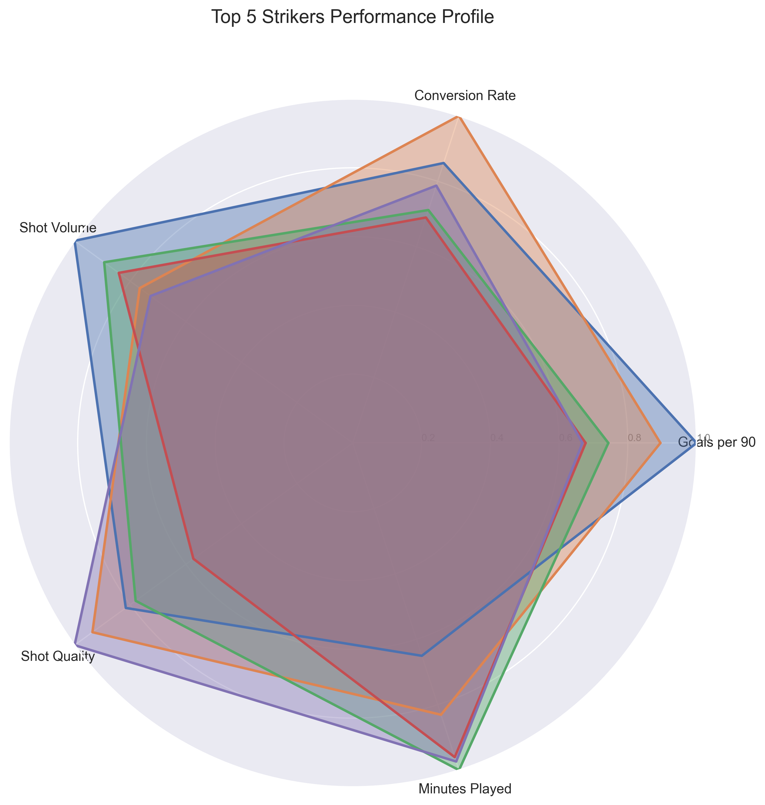

# Arsenal Striker Analysis Project

## Project Overview

This project implements a data-driven analysis system for identifying suitable striker targets for Arsenal FC. Using advanced statistical analysis and visualization techniques, the model evaluates strikers based on various performance metrics including goals, expected goals (xG), shot accuracy, and other key performance indicators. The analysis focuses on the 2024-2025 season data from top European leagues.

## Data Analysis Features

### Key Metrics Analyzed
- Goals and Expected Goals (xG)
- Shot Accuracy and Shot Volume
- Goals per 90 minutes
- Progressive Actions
- Age and Transfer Potential

### Visualization Types
1. **Radar Charts**: Performance profile comparison of top strikers
2. **Goals vs xG Scatter**: Performance vs expectation analysis
3. **Shot Quality Heatmap**: Correlation between shooting metrics
4. **Performance Comparison**: Direct comparison of key statistics

## Sample Visualizations

### Radar Chart Analysis

*Performance profile comparison of top 5 striker targets*

### Goals vs Expected Goals Analysis

*Comparison of actual goals scored versus expected goals (xG)*

### Shot Quality Analysis

*Correlation heatmap of key shooting metrics*

### Performance Metrics Comparison

*Direct comparison of key performance indicators*

## Additional Visualizations

### Distribution Plots
- Goals: 
- Expected Goals (xG): 
- Goals per 90: 
- Shots per 90: 
- Shot Accuracy (SoT%): 
- Assists: 
- Minutes: 
- Suitability Score: 

### Boxplots
- Goals: 
- Expected Goals (xG): 
- Goals per 90: 
- Shots per 90: 
- Shot Accuracy (SoT%): 
- Assists: 
- Minutes: 
- Suitability Score: 

### Top 10 Bar Charts
- Goals: 
- Expected Goals (xG): 
- Goals per 90: 
- Shots per 90: 
- Shot Accuracy (SoT%): 
- Assists: 
- Minutes: 
- Suitability Score: 

### Pairplot
- 

### CSV Preview
- 

## Key Findings

### Top Striker Candidates
1. **Ousmane Dembélé (27)**
   - Goals per 90: 1.14
   - Shot Accuracy: 51.6%
   - xG Performance: +5.4 (21 goals vs 15.60 xG)

2. **Mateo Retegui (26)**
   - Goals per 90: 1.02
   - Shot Accuracy: 31.5%
   - xG Performance: +6.5 (24 goals vs 17.50 xG)

3. **Kylian Mbappé (26)**
   - Goals per 90: 0.85
   - Shot Accuracy: 51.2%
   - xG Performance: +3.5 (24 goals vs 20.50 xG)

### Analysis Insights
- Strong correlation between Goals per 90 and xG
- High shot accuracy indicates clinical finishing
- Age profile (24-27) suitable for long-term value

## Project Structure
```
├── scripts/
│   ├── arsenal_striker_analysis.py    # Main analysis script
│   └── visualize_striker_analysis.py  # Visualization generation
├── data/
│   └── players_data-2024_2025.csv    # Player statistics dataset
├── output/
│   ├── radar_chart.png               # Performance profile visualizations
│   ├── goals_xg_scatter.png          # Goals vs xG analysis
│   ├── shot_quality_heatmap.png      # Correlation analysis
│   ├── performance_comparison.png     # Direct stat comparison
│   └── striker_summary_stats.csv     # Detailed statistics
└── requirements.txt                   # Project dependencies
```

## Installation and Usage

### Setup
1. Clone the repository
2. Create a virtual environment:
```bash
python -m venv .venv
.venv\Scripts\activate  # On Windows
```
3. Install dependencies:
```bash
pip install -r requirements.txt
```

### Running the Analysis
1. Run the main analysis:
```bash
python scripts/arsenal_striker_analysis.py
```
2. Generate visualizations:
```bash
python scripts/visualize_striker_analysis.py
```

## Data Sources
- Player statistics sourced from FBref
- 2024-2025 season data from top European leagues
- Focus on forwards under 28 years old with 15+ matches played

## Future Improvements
1. **Data Enhancement**
   - Include more advanced metrics (pressing stats, build-up involvement)
   - Add historical performance trends
   - Include transfer market valuations

2. **Analysis Extensions**
   - Tactical fit analysis
   - League difficulty adjustment
   - Team playing style compatibility

3. **Visualization Enhancements**
   - Interactive dashboards
   - Real-time data updates
   - Comparative league analysis

## License
MIT License

## Author
Jaka Kus 

## Who Should Arsenal Buy? (2024-2025)

Based on the data-driven analysis, the following strikers are the most suitable and realistic targets for Arsenal:

### Recommended Striker Targets
1. **Mateo Retegui (Atalanta, Age 26)**
   - Goals per 90: 1.02
   - Shot Accuracy: 31.5%
   - xG Performance: +6.5 (24 goals vs 17.50 xG)
   - *Proven scorer in a top league, not at a "super club," and fits Arsenal's age/transfer profile.*
2. **Alexander Isak (Newcastle Utd, Age 25)**
   - Goals per 90: 0.80
   - Shot Accuracy: 42.0%
   - xG Performance: +3.1 (23 goals vs 19.90 xG)
   - *Consistent, high-volume shooter, and a realistic target if Newcastle are open to selling.*
3. **Georges Mikautadze (Lyon, Age 24)**
   - Goals per 90: 0.70
   - Shot Accuracy: 43.1%
   - xG Performance: +0.8 (11 goals vs 10.20 xG)
   - *Young, clinical, and likely available for transfer.*
4. **Jonathan Burkardt (Mainz 05, Age 24)**
   - Goals per 90: 0.75
   - Shot Accuracy: 40.7%
   - xG Performance: +2.8 (16 goals vs 13.20 xG)
   - *Strong Bundesliga performer, fits Arsenal's age and value profile.*

*See the [summary table](output/striker_summary_stats.csv) and [CSV preview](output/csv_preview.png) for more details on all candidates.*

---

## Unrealistic or Excluded Targets

Some high-profile players score well in the analysis but are **excluded as realistic Arsenal targets** for the following reasons:

- **Ousmane Dembélé (Paris S-G)**
- **Kylian Mbappé (Real Madrid)**
- **Omar Marmoush (Manchester City → Eint Frankfurt)**
- **Erling Haaland (Manchester City)**

**Why are they excluded?**
- Play for "super clubs" (PSG, Real Madrid, Manchester City) who are highly unlikely to sell to Arsenal.
- Transfer fees and wage demands would be prohibitively high.
- Some are not natural strikers or do not fit Arsenal's tactical needs.
- The analysis focuses on players who are both high-performing and realistically attainable.

---

## How Candidates Are Chosen
- Players must be under 28, have played 15+ matches, and scored 10+ goals in top European leagues.
- Excludes players from clubs with a very low likelihood of selling (e.g., PSG, Real Madrid, Man City, etc.).
- Considers age, performance, and transfer potential for long-term value.

---

## Transparency
- The full player data is available in [data/players_data-2024_2025.csv](data/players_data-2024_2025.csv).
- A preview of the data and summary tables is available in the [output/](output/) directory.
- All code and analysis steps are open source for review and reproducibility. 