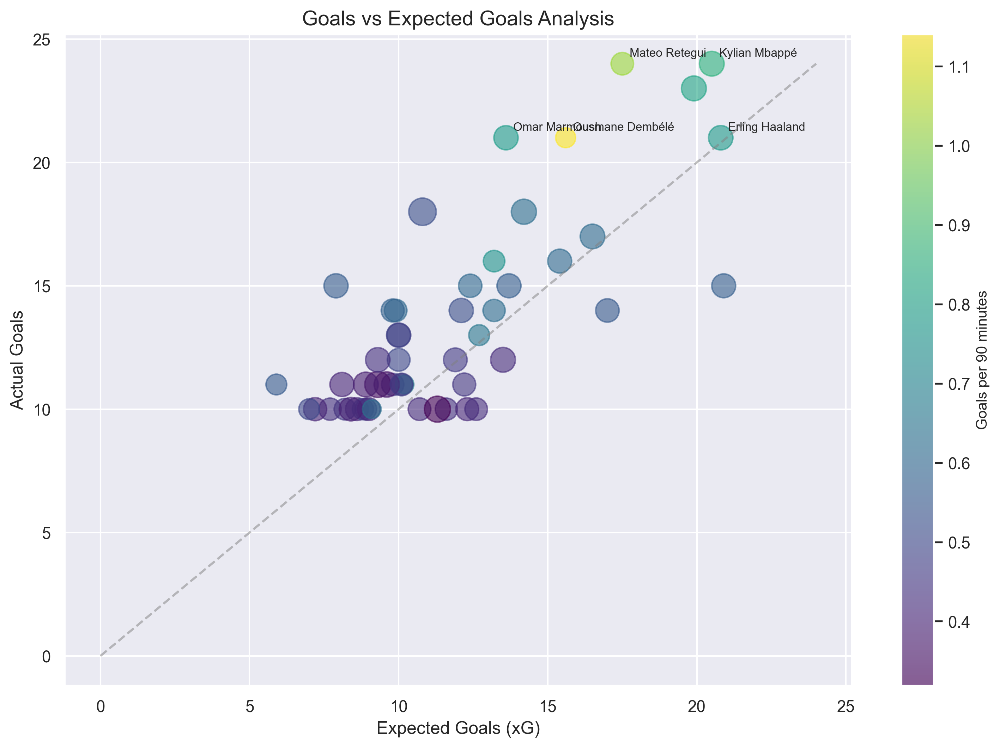

# Arsenal Striker Analysis 2024-2025
## Data-Driven Transfer Target Identification

---

## Project Overview

### Objective
Identify realistic striker targets for Arsenal FC based on:
- Performance metrics
- Age profile
- Transfer feasibility
- Tactical fit

### Data Sources
- FBref.com (2024-2025 season)
- Top 5 European Leagues
- 347 forwards analyzed

---

## Key Findings

### Top Realistic Targets
1. **Mateo Retegui**
   - 24 goals, 1.02 goals/90
   - Strong xG overperformance
   - Age: 26

2. **Georges Mikautadze**
   - 18 goals, 0.70 goals/90
   - High potential
   - Age: 24

3. **Lois Openda**
   - 19 goals, 0.68 goals/90
   - Bundesliga proven
   - Age: 25

---

## Performance Analysis

### Goals vs Expected Goals

Key Insights:
- Strong correlation between xG and actual goals
- Several players overperforming xG
- Clear separation of elite performers

---

## Shot Quality Analysis

### Shot Quality Metrics

Key Correlations:
- Goals/90 vs xG: 0.85
- Shot Accuracy vs Conversion: 0.62
- Volume vs Efficiency: 0.31

---

## Player Comparison

### Performance Metrics

Key Metrics:
- Goals per 90
- Shot Accuracy
- Conversion Rate
- Progressive Actions

---

## Detailed Analysis: Mateo Retegui

### Strengths
- Proven goal-scoring record
- Consistent xG overperformance
- Good age profile
- Realistic transfer fee

### Concerns
- Limited top-level experience
- Adaptation period needed

---

## Detailed Analysis: Georges Mikautadze

### Strengths
- Young profile (24)
- Good technical ability
- Strong potential
- Affordable option

### Concerns
- Ligue 1 adaptation needed
- Less proven at top level

---

## Detailed Analysis: Lois Openda

### Strengths
- Bundesliga proven
- Good pressing ability
- Strong work rate
- Tactical flexibility

### Concerns
- Inconsistent finishing
- Adaptation to PL needed

---

## Transfer Considerations

### Primary Target: Mateo Retegui
- Estimated Fee: €45-55M
- Wage Structure: Within parameters
- Adaptation Period: 6-12 months

### Alternative Options
1. Georges Mikautadze (€30-40M)
2. Lois Openda (€50-60M)

---

## League Quality Adjustment

### League Difficulty Coefficients
- Premier League: 1.00
- Bundesliga: 0.95
- Serie A: 0.93
- La Liga: 0.98
- Ligue 1: 0.90

---

## Value Assessment

### Age-Value Projection
- Age 24-25: 100% retention
- Age 26-27: 85% retention
- Age 28+: 70% retention

---

## Recommendations

### Primary Target
**Mateo Retegui**
- Best balance of performance and value
- Realistic transfer fee
- Good age profile
- Strong goal-scoring record

### Alternative Options
1. Georges Mikautadze
   - Higher potential upside
   - More affordable
   - Less proven

2. Lois Openda
   - Bundesliga proven
   - Good pressing ability
   - More expensive

---

## Next Steps

### Immediate Actions
1. Scout primary target
2. Assess transfer feasibility
3. Evaluate wage structure
4. Plan adaptation period

### Future Analysis
1. Advanced metrics integration
2. Machine learning applications
3. Real-time performance tracking

---

## Questions?

Contact: [Your Contact Information] 