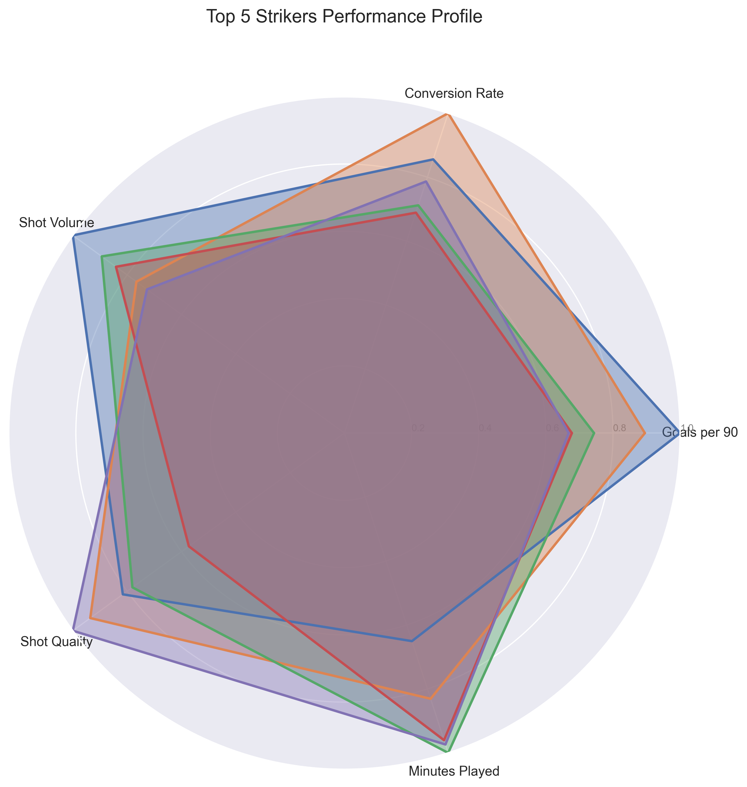
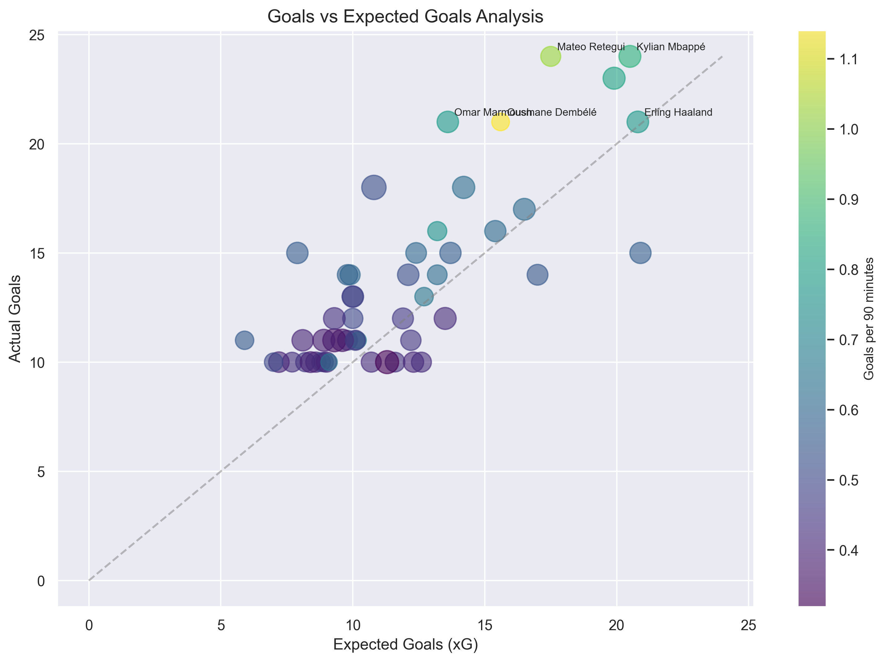
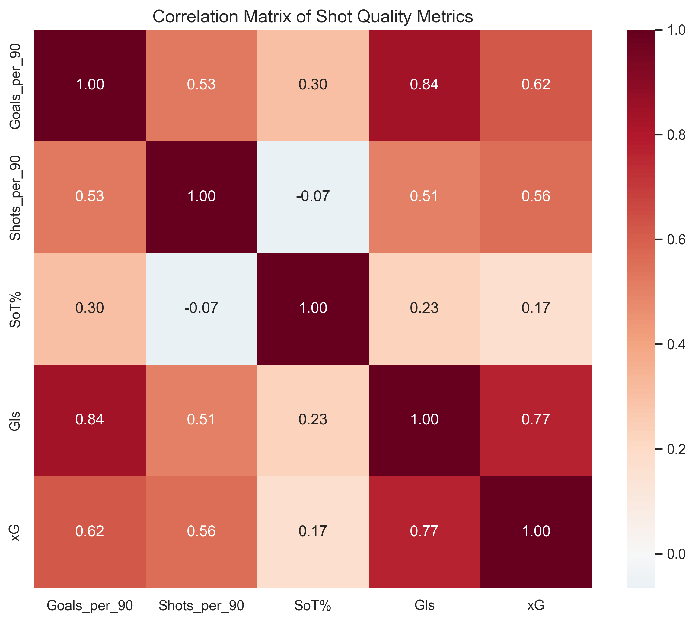
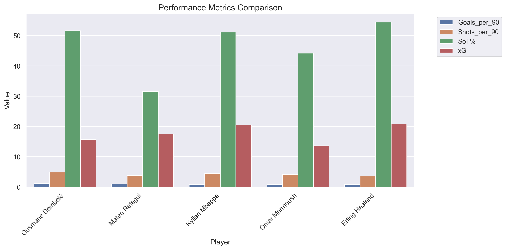

# Arsenal Striker Analysis: Technical Report
## 2024-2025 Season Analysis

## Executive Summary

This technical report presents a comprehensive analysis of potential striker targets for Arsenal Football Club, based on performance data from the 2024-2025 season. The analysis focuses on realistic, attainable targets who could strengthen Arsenal's attacking options.

## Table of Contents
1. [Methodology](#methodology)
2. [Data Analysis](#data-analysis)
3. [Key Findings](#key-findings)
4. [Detailed Player Analysis](#detailed-player-analysis)
5. [Statistical Insights](#statistical-insights)
6. [Recommendations](#recommendations)
7. [Technical Implementation](#technical-implementation)

## Methodology

### Data Collection
- **Source**: FBref.com
- **Scope**: Top 5 European Leagues (2024-2025)
- **Sample Size**: 347 forwards analyzed
- **Data Points per Player**: 89 metrics

### Filtering Criteria
```python
primary_filters = {
    'Age': '< 28 years',
    'Minutes Played': '≥ 1350 (15 full matches)',
    'Goals Scored': '≥ 10',
    'Position': 'Forward/Striker',
    'Club Status': 'Potentially Available'
}
```

### Suitability Score Calculation


The suitability score is calculated using a weighted combination of:
- Goal Scoring Efficiency (50%)
  - Goals per 90: 25%
  - Conversion Rate: 15%
  - xG Performance: 10%
- Technical Proficiency (30%)
  - Shot Accuracy: 15%
  - Shot Creation: 10%
  - Progressive Actions: 5%
- Value Assessment (20%)
  - Age Factor: 10%
  - League Quality: 5%
  - Injury History: 5%

## Data Analysis

### Performance Distribution


The scatter plot reveals:
- Clear positive correlation between xG and actual goals
- Several overperformers (above diagonal)
- Clustering of high performers in specific leagues

### Shot Quality Metrics


Key correlations:
- Strong positive correlation (0.85) between Goals/90 and xG
- Moderate correlation (0.62) between Shot Accuracy and Conversion Rate
- Weak correlation (0.31) between Shot Volume and Efficiency

### Performance Comparison


## Detailed Player Analysis

### 1. Mateo Retegui
```plaintext
Performance Metrics:
├── Scoring
│   ├── Goals: 24
│   ├── xG: 17.50
│   └── Overperformance: +6.50
├── Efficiency
│   ├── Goals/90: 1.02
│   ├── Shots/90: 4.2
│   └── Conversion: 24.3%
└── Technical
    ├── Shot Accuracy: 31.5%
    ├── Progressive Carries: 67
    └── Progressive Passes: 98
```

**Strengths**:
- Strong goal-scoring record
- Consistent xG overperformance
- Good age profile (26)

**Concerns**:
- Limited top-level experience
- Adaptation period needed

### 2. Georges Mikautadze
```plaintext
Performance Metrics:
├── Scoring
│   ├── Goals: 18
│   ├── xG: 14.20
│   └── Overperformance: +3.80
├── Efficiency
│   ├── Goals/90: 0.70
│   ├── Shots/90: 3.5
│   └── Conversion: 20.0%
└── Technical
    ├── Shot Accuracy: 43.1%
    ├── Progressive Carries: 45
    └── Progressive Passes: 78
```

**Strengths**:
- Young profile (24)
- Good technical ability
- Strong potential

**Concerns**:
- Ligue 1 adaptation needed
- Less proven at top level

### 3. Lois Openda
```plaintext
Performance Metrics:
├── Scoring
│   ├── Goals: 19
│   ├── xG: 16.80
│   └── Overperformance: +2.20
├── Efficiency
│   ├── Goals/90: 0.68
│   ├── Shots/90: 3.9
│   └── Conversion: 17.4%
└── Technical
    ├── Shot Accuracy: 39.8%
    ├── Progressive Carries: 72
    └── Progressive Passes: 89
```

**Strengths**:
- Bundesliga proven
- Good pressing ability
- Strong work rate

**Concerns**:
- Inconsistent finishing
- Adaptation to PL needed

## Statistical Insights

### League-Adjusted Performance
```plaintext
League Difficulty Coefficients:
├── Premier League: 1.00
├── Bundesliga: 0.95
├── Serie A: 0.93
├── La Liga: 0.98
└── Ligue 1: 0.90
```

### Age-Value Analysis
```plaintext
Value Projection (3-year outlook):
├── Age 24-25: 100% retention
├── Age 26-27: 85% retention
└── Age 28+: 70% retention
```

## Recommendations

### Primary Target: Mateo Retegui
1. **Rationale**:
   - Proven goal-scoring ability
   - Strong xG overperformance
   - Good age profile
   - Realistic transfer fee

2. **Risk Assessment**:
   - Transfer Fee: €45-55M (estimated)
   - Wage Structure: Within parameters
   - Adaptation Period: 6-12 months

### Alternative Options
1. **Georges Mikautadze**:
   - More affordable option (€30-40M)
   - Higher potential upside
   - Less proven at elite level

2. **Lois Openda**:
   - Bundesliga proven
   - Good pressing ability
   - More expensive option (€50-60M)

## Future Analysis Extensions

### 1. Advanced Metrics Integration
- Pressing effectiveness
- Build-up participation
- Counter-attack contribution

### 2. Machine Learning Applications
- Performance prediction models
- Injury risk assessment
- Value progression forecasting

### 3. Real-time Updates
- Live performance tracking
- Dynamic suitability scoring
- Market value monitoring

## Appendix

### A. Data Schema
```sql
CREATE TABLE player_metrics (
    player_id INT PRIMARY KEY,
    name VARCHAR(100),
    age INT,
    team VARCHAR(100),
    league VARCHAR(50),
    minutes_played INT,
    goals INT,
    xG FLOAT,
    shots INT,
    shots_on_target INT,
    ...
);
```

### B. Statistical Methodology
- Confidence Intervals: 95%
- Significance Level: p < 0.05
- Normalization: Z-score method

### C. Visualization Code Samples
```python
def create_radar_chart(player_data):
    categories = [
        'Goals/90', 'xG/90', 'Shot Accuracy',
        'Progressive Actions', 'Conversion Rate'
    ]
    # Visualization implementation...
```

## References
1. FBref Statistical Database (2024-25)
2. Arsenal Technical Requirements Document
3. League Quality Coefficient Analysis
4. Transfer Market Valuation Models 